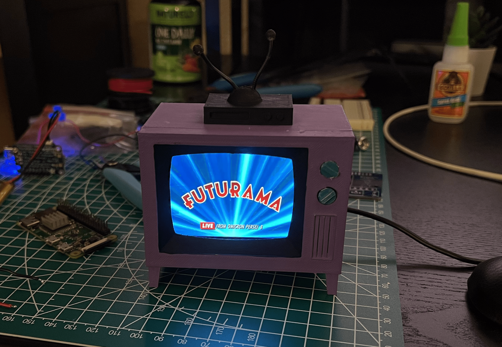
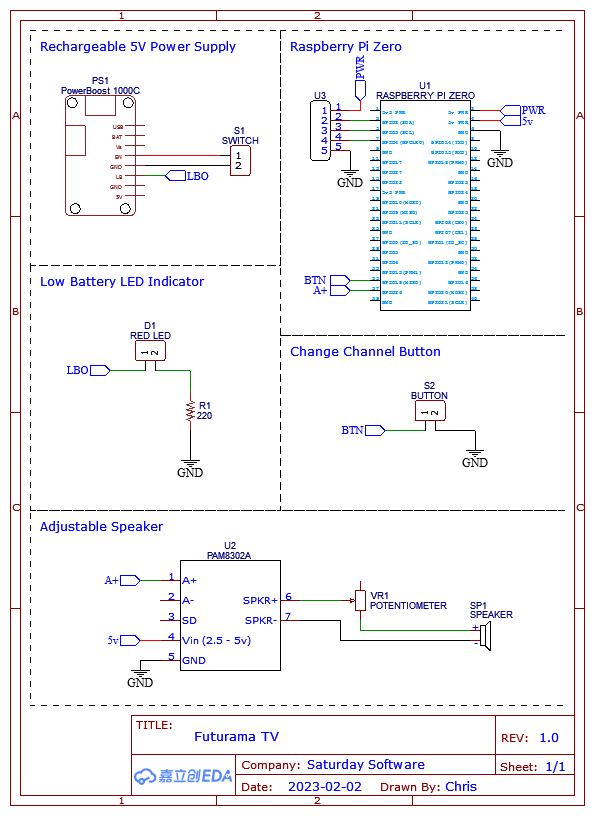
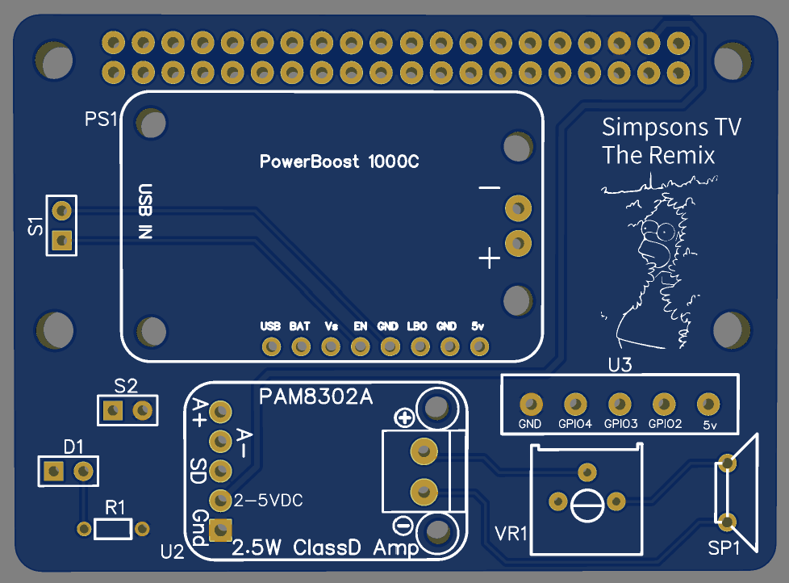
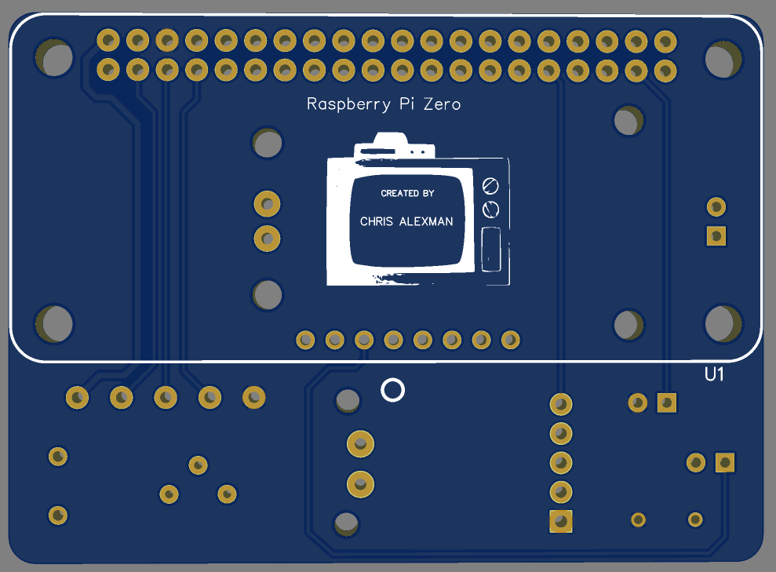

# futurama-tv



This is a remix of the Simpsons TV project that was [featured here](https://www.reddit.com/r/3Dprinting/comments/p9lasb/i_designed_and_printed_a_working_simpsons_tv/), please check out the creator's [GitHub](https://github.com/buba447/simpsonstv) and [build guide](https://withrow.io/simpsons-tv-build-guide-waveshare). I changed the project by adding a custom PCB and by swapping the Simpsons for Futurama.

```
Good news, everyone!
- Professor Farnsworth
```

## Mini Futurama TV


A miniature tv that plays episodes of Futurama at random. The screen turns on / off by pushing a knob on the front of the tv.

## Changes

The main changes from the original project include:
- omxplayer depricated on raspberry pi, replaced with vlc
- created shell script to run 2 python files in parallel
- swapped systemd with autostart to run scripts on boot after gui loads
- added PCB for cleaner wiring

## Schematic

The schematic was created using [EasyEDA](https://easyeda.com/) as I have used it before and it's easy to order PCBs from [JLCPCB](https://jlcpcb.com/?href=easyeda-home). (if I were to do this project again I would go with [KiCad](https://www.kicad.org/) instead to learn a different software)



Here is more explanation for each of the sections in the schematic:
- **Rechargeable 5V Power Supply.** the switch lets you cut power between the pi zero and the battery, to turn off the system
- **Raspberry Pi Zero.** the main computer, talks to all the other parts through GPIO pins
- **Low Battery LED Indicator.** to alert the user that the battery is getting low and needs to be recharged ([the documentation](https://learn.adafruit.com/adafruit-powerboost-1000c-load-share-usb-charge-boost/pinouts))
- **Change Channel Button.** button input, tell vlc to go to the next episode
- **Adjustable Speaker.** adjust speaker volume output with a knob on the front of the tv connected to a potentiometer

## Printed Circuit Board (PCB)

The PCB was also created with [EasyEDA](https://easyeda.com/) and ordered through [JLCPCB](https://jlcpcb.com/?href=easyeda-home).



The front:
- **PS1/S1** - Rechargeable 5V Power Supply
- **D1/R1** - Low Battery LED Indicator
- **S2** - Change Channel Button
- **U2/VR1/SP1** - Adjustable Speaker
- **U3** - additional 5V, GND, and 3 GPIO pins


The back:
- **U1** - Raspberry Pi Zero

## Parts

Here is a parts list of everything used so that anyone can replicate this project. This is a bare-bones version of the build without the rechargable power supply, lithium-ion battery, or audio components:
| qty | part | desc | price |
| :---: | --- | --- | --- |
| 1 | [raspberry pi zero WH](https://www.pishop.us/product/raspberry-pi-zero-w/) | internal computer | $15.00 |
| 1 | [2.8in 640x480 screen](https://www.waveshare.com/2.8inch-dpi-lcd.htm) | screen |  $34.99|
| 1 | [16gb micro sd card](https://www.amazon.com/Sandisk-Ultra-Micro-UHS-I-Adapter/dp/B073K14CVB/ref=sr_1_3?keywords=16gb+micro+sd+card&qid=1691353478&sr=8-3) | computer storage | $8.45 |
| 1 | [power supply](https://www.amazon.com/CanaKit-Raspberry-Supply-Adapter-Listed/dp/B00MARDJZ4/ref=sr_1_4?crid=FDD9MEHZVH7R&keywords=raspberry+pi+power+supply&qid=1690765735&sprefix=raspberry+pi+pow%2Caps%2C3093&sr=8-4) | power the pi | $9.95 |
| 1 | [push button](https://www.amazon.com/Uxcell-a14073000ux0157-Square-Latching-Action/dp/B00S4VZZR0/ref=sr_1_19?crid=2R9H0INXB3R66&keywords=breadboard+push+button+switch&qid=1690764628&sprefix=breadboard+push+button+switch%2Caps%2C200&sr=8-19) | knob to turn tv on/off | $8.49 |
| 1 | [22AWG wire](https://www.amazon.com/gp/product/B00QTCBZ4I?ie=UTF8&linkCode=sl1&tag=withrow-20&linkId=e2a84db7f4efcf0f9d240aa2a862513d&language=en_US&ref_=as_li_ss_tl&th=1) | connect parts inside | $9.99 |
| 1 | [3d printer filament](https://www.amazon.com/HATCHBOX-3D-Filament-Dimensional-Accuracy/dp/B00J0ECR5I/ref=sr_1_3?crid=7XO0WME55JD4&keywords=hatchbox+black+pla&qid=1690766165&sprefix=hatchbox+black+pla%2Caps%2C562&sr=8-3) | 3d print material | $24.99 |
| 1 | [white primer paint](https://www.amazon.com/Rust-Oleum-249127-Painters-Purpose-12-Ounce/dp/B002BWOS7Q/ref=sr_1_1?crid=K9M7X2A52FXO&keywords=rustoleum+2x&qid=1690765661&sprefix=rustoleum+2x%2Caps%2C205&sr=8-1) | prime before painting | $10.99 |
| 1 | [acrylic paint](https://www.amazon.com/s?k=acrylic+paint&ref=nb_sb_noss) | paint the tv | $7.00 |

rough project total: $129.85

This can be reduced if you already have any of the parts on hand or if you opt for a different screen and power supply.

## Setup (Hardware)

The 3d print files can be [found on thingiverse](https://www.thingiverse.com/thing:4943159). I used an Ender 5 3d printer with a non-white filament, so that the white primer paint can be seen easier, and then just acrylic paint to match the simpsons tv colors as close as possible.


The primed and painted tv body, tv front, top VCR, knobs, and antenna ends.


The tv assembled before putting all the parts inside.

## Setup (Software)

The steps to set up the software can be followed from the [build guide](https://withrow.io/simpsons-tv-build-guide-waveshare) with the following exceptions:

### Screen Setup

Open [the documentation](https://www.waveshare.com/wiki/2.8inch_DPI_LCD) for the 2.8in screen.

1. The default OS from the [raspberry pi imager](https://www.raspberrypi.com/software/) was from the Bullseye branch, so paste the following into `config.txt`:
```
dtoverlay=vc4-kms-v3d
dtoverlay=vc4-kms-DPI-28inch
dtoverlay=waveshare-28dpi-3b-4b   
dtoverlay=waveshare-28dpi-3b
dtoverlay=waveshare-28dpi-4b
```
2. You can download the screen [driver code](https://www.waveshare.com/w/upload/b/b5/28DPI-DTBO.zip) to unzip and drag into the `overlays` directory.
3. Note the sections for **Rotation** to rotate the screen and **Interface** to see the GPIO pins that are not used by the screen, which let's us use them for the other parts.

### Enabling Audio

If you want to omit the audio and speaker parts of the build, you can skip this section of the build guide.

### Installing VLC

The omxplayer video player was depricated for the raspberry pi. You can install VLC instead, run this in the command line:
```
sudo apt-get install vlc
```

### Running Scripts on Boot

Skip the section of the build guide that has you use systemd and follow this instead:

To run the 2 main python scripts on boot after the gui loads:
1. Create a bash script - `sudo nano futurama-tv.sh`
2. Paste the following into the file, save & exit after.
```
#!/bin/bash

/usr/bin/python3 /home/pi/Documents/futurama-tv/buttons.py &
/usr/bin/python3 /home/pi/Documents/futurama-tv/player.py &
```
3. Make it executable - `sudo chmod +x futurama-tv.sh`
4. Create a .desktop file - `sudo nano /etc/xdg/autostart/display.desktop`
5. Paste the following into the file, save & exit after.
```
[Desktop Entry]
Name=futurama-tv
Exec=/bin/bash /home/pi/Documents/futurama-tv/futurama-tv.sh
```

## Missing Features

I did this project with a short deadline and had to pivot a bit on a few features from the original plan. Here is a list of the missing features with an explanation of why they are missing:

- **Battery Powered** - the rechargeable power supply and lithium-ion battery couldn't fit in the tv housing with both the custom PCB and speaker, decided to power the system with the original raspberry pi power supply that plugs into the wall
- **Change Channel** - I couldn't find a reliable way for the `player.py` script to both run the video files and be able to skip to the next episode at the same time, this feature was omitted
- **Audio** - the audio output is handled by the pwm GPIO pins of the pi zero, I tried every audio output on VLC but wasn't able to output the audio through the GPIO pins

## Images


In development


Intro playing


Screen off

## Bonus Content


Episode 1 - Space Pilot 3000

This is what happened when I ran vlc in the terminal and didn't specify to the correct display to output to. This was fixed by running the following in the command line:
`vlc --x11-display :0 <path_to_videos> -f --random`

## License

[MIT](LICENSE)
